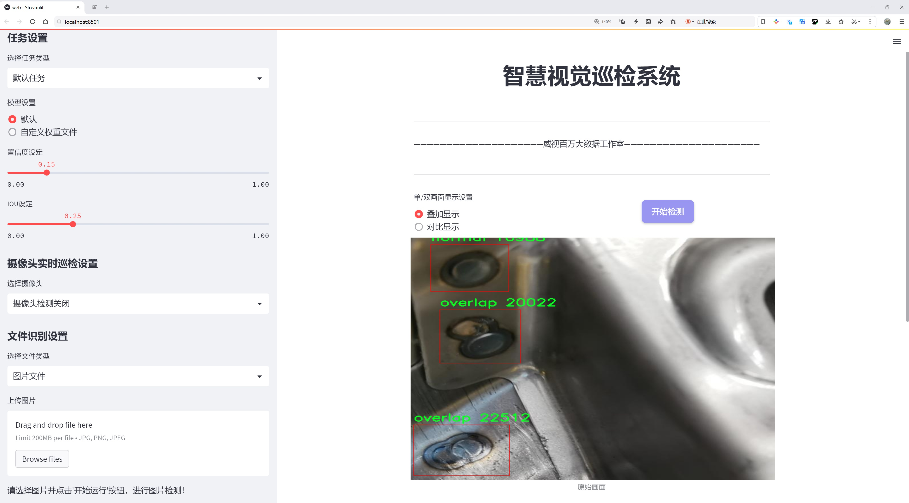
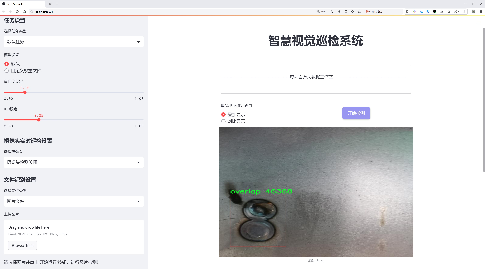
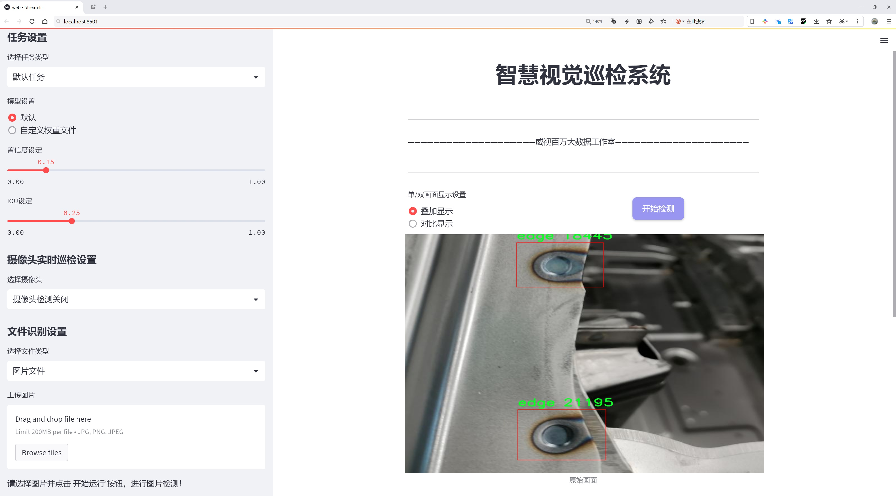
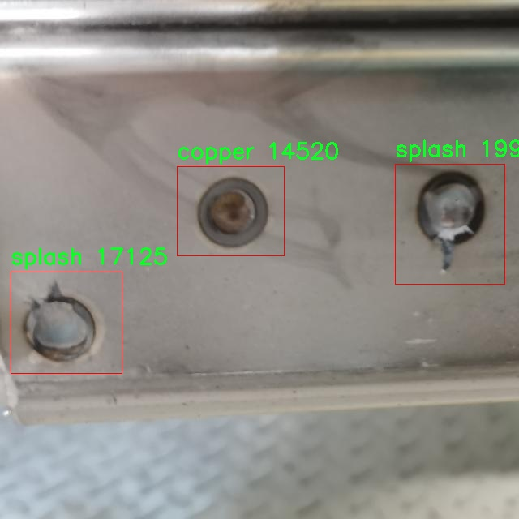
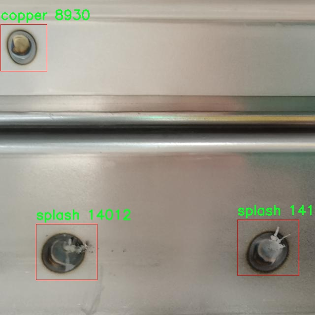
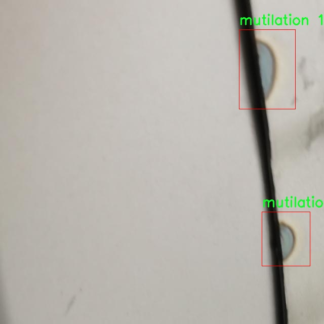
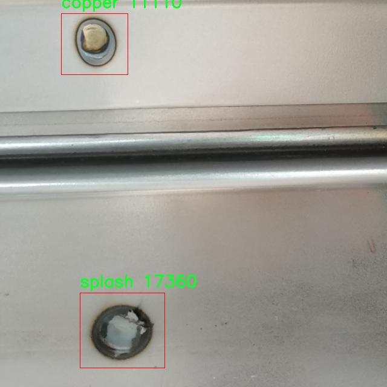
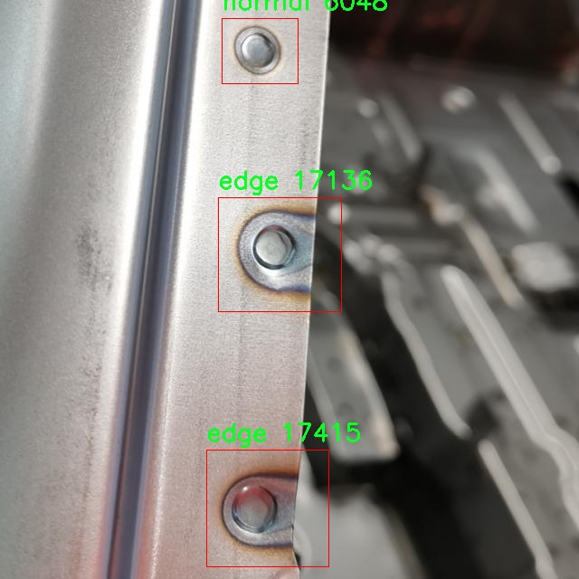

# 焊接缺陷检测检测系统源码分享
 # [一条龙教学YOLOV8标注好的数据集一键训练_70+全套改进创新点发刊_Web前端展示]

### 1.研究背景与意义

项目参考[AAAI Association for the Advancement of Artificial Intelligence](https://gitee.com/qunmasj/projects)

项目来源[AACV Association for the Advancement of Computer Vision](https://kdocs.cn/l/cszuIiCKVNis)

研究背景与意义

焊接作为一种重要的连接工艺，广泛应用于制造业、建筑业及汽车工业等多个领域。随着工业自动化和智能化的不断发展，焊接质量的检测与控制显得尤为重要。焊接缺陷不仅会影响产品的安全性和可靠性，还可能导致巨大的经济损失。因此，开发高效、准确的焊接缺陷检测系统，成为了行业内亟待解决的技术难题。

近年来，计算机视觉和深度学习技术的迅猛发展，为焊接缺陷检测提供了新的解决方案。YOLO（You Only Look Once）系列模型因其高效的实时目标检测能力，逐渐成为工业检测领域的研究热点。特别是YOLOv8的推出，进一步提升了目标检测的精度和速度，使其在复杂环境下的应用成为可能。然而，传统YOLOv8模型在特定应用场景下，尤其是焊接缺陷检测中，仍然面临着一些挑战，例如对小目标的检测能力不足、对复杂背景的适应性差等。因此，基于改进YOLOv8的焊接缺陷检测系统的研究具有重要的理论和实际意义。

本研究所使用的数据集“Resistance_Spot_Welding”包含4100张图像，涵盖了8种焊接缺陷类别，包括铜、边缘、假焊、缺损、正常、重叠、飞溅和扭曲等。这些类别的多样性为模型的训练提供了丰富的样本，有助于提升模型的泛化能力和检测精度。通过对这些缺陷进行分类和检测，能够为焊接过程中的质量控制提供重要依据，帮助工程师及时发现和纠正焊接缺陷，从而降低生产成本，提高产品质量。

在焊接缺陷检测的研究中，数据集的构建和标注是至关重要的一环。高质量的数据集不仅需要涵盖多种缺陷类型，还需在不同的光照、角度和背景下进行采集，以确保模型在实际应用中的鲁棒性。通过对“Resistance_Spot_Welding”数据集的深入分析与处理，可以为后续的模型训练提供坚实的基础。此外，改进YOLOv8模型的特征提取和后处理算法，将有助于提升对小目标和复杂背景下焊接缺陷的检测能力。

综上所述，基于改进YOLOv8的焊接缺陷检测系统的研究，不仅能够推动焊接检测技术的发展，还将为工业界提供一种高效、可靠的解决方案。通过结合深度学习与计算机视觉技术，能够实现对焊接缺陷的自动化检测，降低人工检测的工作强度，提高检测的准确性和效率。未来，随着技术的不断进步，该系统有望在更广泛的工业应用中发挥重要作用，为智能制造和工业4.0的实现贡献力量。

### 2.图片演示







##### 注意：由于此博客编辑较早，上面“2.图片演示”和“3.视频演示”展示的系统图片或者视频可能为老版本，新版本在老版本的基础上升级如下：（实际效果以升级的新版本为准）

  （1）适配了YOLOV8的“目标检测”模型和“实例分割”模型，通过加载相应的权重（.pt）文件即可自适应加载模型。

  （2）支持“图片识别”、“视频识别”、“摄像头实时识别”三种识别模式。

  （3）支持“图片识别”、“视频识别”、“摄像头实时识别”三种识别结果保存导出，解决手动导出（容易卡顿出现爆内存）存在的问题，识别完自动保存结果并导出到tempDir中。

  （4）支持Web前端系统中的标题、背景图等自定义修改，后面提供修改教程。

  另外本项目提供训练的数据集和训练教程,暂不提供权重文件（best.pt）,需要您按照教程进行训练后实现图片演示和Web前端界面演示的效果。

### 3.视频演示

[3.1 视频演示](https://www.bilibili.com/video/BV1qSsheTEwB/)

### 4.数据集信息展示

##### 4.1 本项目数据集详细数据（类别数＆类别名）

nc: 8
names: ['copper', 'edge', 'fake', 'mutilation', 'normal', 'overlap', 'splash', 'twist']


##### 4.2 本项目数据集信息介绍

数据集信息展示

在焊接缺陷检测领域，数据集的质量和多样性直接影响到模型的训练效果和最终的检测性能。本研究所使用的数据集名为“Resistance_Spot_Welding”，专门针对电阻点焊过程中的缺陷进行标注和分类。该数据集包含八个不同的类别，分别为“copper”、“edge”、“fake”、“mutilation”、“normal”、“overlap”、“splash”和“twist”。这些类别涵盖了焊接过程中可能出现的各种缺陷，提供了丰富的样本以供模型学习和识别。

首先，类别“copper”代表了焊接过程中可能出现的铜材料缺陷。这类缺陷通常与焊接材料的选择和处理有关，可能导致焊接接头的强度和稳定性下降。其次，“edge”类别则指向焊接边缘的缺陷，可能表现为焊接接头的边缘不规则或不平整，这会影响焊接质量和结构的完整性。接下来，“fake”类别涉及伪缺陷，这些缺陷可能是由于焊接过程中的误判或设备故障所导致，具有一定的误导性。

此外，“mutilation”类别则描述了焊接接头的破损或损伤情况，这种缺陷可能源于焊接过程中温度控制不当或机械应力过大。“normal”类别则代表了理想的焊接状态，作为对比样本，它帮助模型学习到何为合格的焊接接头。“overlap”类别则指焊接金属的重叠现象，这种情况通常会导致焊接接头的强度降低，影响其承载能力。“splash”类别则描述了焊接过程中熔融金属的飞溅现象，这种缺陷不仅影响美观，还可能导致电气短路等安全隐患。最后，“twist”类别则指焊接接头的扭曲情况，这种缺陷通常与焊接工艺的控制有关，可能导致接头的应力集中，从而影响其长期使用性能。

通过对“Resistance_Spot_Welding”数据集的分析，可以看出，该数据集不仅涵盖了多种焊接缺陷类型，还提供了丰富的样本量，以便于训练改进YOLOv8模型。YOLOv8作为一种先进的目标检测算法，能够在实时检测中提供高效的性能。结合这一数据集，模型能够学习到不同缺陷的特征，从而在实际应用中实现高准确率的焊接缺陷检测。

数据集的构建过程遵循严格的标注标准，确保每个样本的标注准确无误。样本的多样性和代表性为模型的泛化能力提供了保障，使其能够在不同的焊接环境和条件下依然保持良好的检测性能。此外，数据集的使用还将促进焊接行业的智能化发展，通过自动化的缺陷检测系统，提高生产效率和产品质量，降低人工检测的成本和误差。

综上所述，“Resistance_Spot_Welding”数据集为改进YOLOv8的焊接缺陷检测系统提供了坚实的基础，助力于实现更高效、更精准的焊接质量控制。通过深入分析和利用这一数据集，研究者能够推动焊接检测技术的进步，为工业应用带来显著的效益。











### 5.全套项目环境部署视频教程（零基础手把手教学）

[5.1 环境部署教程链接（零基础手把手教学）](https://www.ixigua.com/7404473917358506534?logTag=c807d0cbc21c0ef59de5)


[5.2 安装Python虚拟环境创建和依赖库安装视频教程链接（零基础手把手教学）](https://www.ixigua.com/7404474678003106304?logTag=1f1041108cd1f708b01a)

### 6.手把手YOLOV8训练视频教程（零基础小白有手就能学会）

[6.1 手把手YOLOV8训练视频教程（零基础小白有手就能学会）](https://www.ixigua.com/7404477157818401292?logTag=d31a2dfd1983c9668658)

### 7.70+种全套YOLOV8创新点代码加载调参视频教程（一键加载写好的改进模型的配置文件）

[7.1 70+种全套YOLOV8创新点代码加载调参视频教程（一键加载写好的改进模型的配置文件）](https://www.ixigua.com/7404478314661806627?logTag=29066f8288e3f4eea3a4)

### 8.70+种全套YOLOV8创新点原理讲解（非科班也可以轻松写刊发刊，V10版本正在科研待更新）

由于篇幅限制，每个创新点的具体原理讲解就不一一展开，具体见下列网址中的创新点对应子项目的技术原理博客网址【Blog】：


[8.1 70+种全套YOLOV8创新点原理讲解链接](https://gitee.com/qunmasj/good)

### 9.系统功能展示（检测对象为举例，实际内容以本项目数据集为准）

图9.1.系统支持检测结果表格显示

  图9.2.系统支持置信度和IOU阈值手动调节

  图9.3.系统支持自定义加载权重文件best.pt(需要你通过步骤5中训练获得)

  图9.4.系统支持摄像头实时识别

  图9.5.系统支持图片识别

  图9.6.系统支持视频识别

  图9.7.系统支持识别结果文件自动保存

  图9.8.系统支持Excel导出检测结果数据


### 10.原始YOLOV8算法原理

原始YOLOv8算法原理

YOLOv8作为YOLO系列的最新版本，延续了其前身YOLOv5和YOLOv7的优良传统，同时在多个方面进行了创新和优化，尤其是在网络结构、特征提取和目标检测精度上。YOLOv8的核心思想依然是实现快速且高效的目标检测，适用于各种实际应用场景。该算法的网络结构主要由四个部分组成：输入层、Backbone（主干网络）、Neck（特征融合层）和Head（检测模块），每个部分都经过精心设计，以提升整体性能。

在Backbone部分，YOLOv8采用了一系列卷积和反卷积层来提取图像特征。与YOLOv5不同的是，YOLOv8将C3模块替换为C2f模块，后者引入了ELAN（Efficient Layer Aggregation Network）思想，旨在增强特征提取的效率和效果。C2f模块的设计使得网络在保持轻量化的同时，能够更好地捕捉到图像中的细节信息。具体来说，C2f模块由多个CBS（卷积+归一化+SiLU激活）模块和Bottleneck结构组成，通过增加多个shortcut连接，显著缓解了深层网络中的梯度消失问题，从而提高了模型的收敛速度和精度。

在特征提取的过程中，YOLOv8还引入了快速空间金字塔池化（SPPF）模块，该模块通过不同尺寸的池化操作，将多尺度特征图进行合并，进一步增强了特征的表达能力。这种设计使得YOLOv8能够更好地处理不同尺度的目标，提升了对小目标的检测能力。

接下来是Neck部分，YOLOv8采用了PAN-FPN（Path Aggregation Network with Feature Pyramid Network）结构，这一结构的设计目的是为了实现多尺度特征的有效融合。通过自下而上的特征融合，YOLOv8能够将高层特征与中层和浅层特征进行有效结合，确保每一层的特征图都包含丰富的语义信息和细节信息。这种特征融合的策略不仅提升了模型的鲁棒性，还增强了对不同尺寸目标的检测能力，使得YOLOv8在复杂场景下依然能够保持较高的检测精度。

在Head部分，YOLOv8采用了解耦头的结构，取消了传统的Anchor-based方法，转而使用Anchor-Free的思想。这一转变使得模型在处理目标检测时更加灵活，能够适应不同形状和尺寸的目标。YOLOv8的Head部分包含三个检测头，分别负责不同尺度的目标检测，利用特征图的多样性来提高检测的准确性和效率。每个检测头通过一系列卷积层和反卷积层生成最终的检测结果，确保了模型在不同尺寸信息下的高效处理。

此外，YOLOv8在损失函数的设计上也进行了创新，采用了VFLLoss作为分类损失，并结合DFLLoss和CIoULoss来优化回归任务。这种多损失函数的组合使得模型在训练过程中能够更好地平衡分类和回归的任务，提高了整体的检测性能。同时，YOLOv8引入了Task-Aligned的样本匹配策略，替代了传统的静态匹配方法，从而使得训练过程更加高效和灵活。

值得一提的是，YOLOv8在数据预处理方面也借鉴了YOLOv5的策略，采用了马赛克增强、混合增强、空间扰动和颜色扰动等多种数据增强手段，以提高模型的泛化能力和鲁棒性。这些预处理手段的引入，进一步提升了YOLOv8在实际应用中的表现，使其能够适应各种复杂的环境和场景。

综上所述，YOLOv8算法通过对Backbone、Neck和Head结构的精心设计和优化，结合创新的损失函数和数据预处理策略，成功实现了在目标检测任务中的高效性和准确性。其在处理不同尺度目标、提高检测精度和速度方面的优势，使得YOLOv8成为当前目标检测领域的一项重要进展，具有广泛的应用前景。随着YOLOv8的不断发展和完善，未来有望在更多实际应用中发挥更大的作用。


### 11.项目核心源码讲解（再也不用担心看不懂代码逻辑）

#### 11.1 ui.py

以下是对给定代码的核心部分进行提炼和详细注释的版本：

```python
import sys  # 导入系统相关的模块
import subprocess  # 导入用于执行子进程的模块
from QtFusion.path import abs_path  # 从 QtFusion.path 导入 abs_path 函数，用于获取绝对路径

def run_script(script_path):
    """
    使用当前 Python 环境运行指定的脚本。

    Args:
        script_path (str): 要运行的脚本路径

    Returns:
        None
    """
    # 获取当前 Python 解释器的路径
    python_path = sys.executable

    # 构建运行命令，使用 streamlit 运行指定的脚本
    command = f'"{python_path}" -m streamlit run "{script_path}"'

    # 执行命令并等待其完成
    result = subprocess.run(command, shell=True)
    
    # 检查命令执行的返回码，如果不为0，表示执行出错
    if result.returncode != 0:
        print("脚本运行出错。")

# 主程序入口
if __name__ == "__main__":
    # 获取要运行的脚本的绝对路径
    script_path = abs_path("web.py")

    # 调用函数运行指定的脚本
    run_script(script_path)
```

### 代码分析与注释说明：

1. **导入模块**：
   - `sys`：用于访问与 Python 解释器相关的变量和函数。
   - `subprocess`：用于生成新进程、连接到它们的输入/输出/错误管道，并获取返回码。
   - `abs_path`：用于获取文件的绝对路径，确保脚本路径是正确的。

2. **`run_script` 函数**：
   - 该函数接收一个脚本路径作为参数，并在当前 Python 环境中运行该脚本。
   - 使用 `sys.executable` 获取当前 Python 解释器的路径，以确保使用正确的 Python 版本。
   - 构建命令字符串，使用 `streamlit` 模块运行指定的脚本。
   - 使用 `subprocess.run` 执行命令，并通过 `shell=True` 允许在 shell 中执行命令。
   - 检查返回码，如果不为0，打印错误信息，表示脚本运行失败。

3. **主程序入口**：
   - 通过 `if __name__ == "__main__":` 确保该部分代码仅在直接运行该脚本时执行。
   - 使用 `abs_path` 获取 `web.py` 的绝对路径，并调用 `run_script` 函数运行该脚本。 

此代码的核心功能是运行一个指定的 Python 脚本，并处理可能出现的错误。

这个文件是一个名为 `ui.py` 的 Python 脚本，主要功能是运行一个名为 `web.py` 的脚本。首先，文件导入了几个必要的模块，包括 `sys`、`os` 和 `subprocess`，以及一个自定义的模块 `QtFusion.path` 中的 `abs_path` 函数。

在 `run_script` 函数中，首先获取当前 Python 解释器的路径，这样可以确保使用正确的 Python 环境来运行脚本。接着，构建一个命令字符串，这个命令会调用 `streamlit` 模块来运行指定的脚本。`streamlit` 是一个用于构建数据应用的库，通常用于快速创建和分享数据应用。

随后，使用 `subprocess.run` 方法执行构建好的命令。这个方法会在一个新的进程中运行命令，并等待其完成。如果命令执行后返回的状态码不为零，表示脚本运行过程中出现了错误，此时会打印出一条错误信息。

在文件的最后部分，使用 `if __name__ == "__main__":` 语句来确保当脚本作为主程序运行时，才会执行以下代码。这里指定了要运行的脚本路径 `web.py`，并调用 `run_script` 函数来执行它。

总体来说，这个脚本的作用是提供一个简单的接口，通过命令行运行一个 Streamlit 应用，方便用户在当前 Python 环境中启动指定的脚本。

#### 11.2 70+种YOLOv8算法改进源码大全和调试加载训练教程（非必要）\ultralytics\models\yolo\detect\val.py

以下是代码中最核心的部分，并附上详细的中文注释：

```python
class DetectionValidator(BaseValidator):
    """
    DetectionValidator类，继承自BaseValidator类，用于基于检测模型的验证。
    """

    def __init__(self, dataloader=None, save_dir=None, pbar=None, args=None, _callbacks=None):
        """初始化检测模型，设置必要的变量和配置。"""
        super().__init__(dataloader, save_dir, pbar, args, _callbacks)  # 调用父类构造函数
        self.nt_per_class = None  # 每个类别的目标数量
        self.is_coco = False  # 是否为COCO数据集
        self.class_map = None  # 类别映射
        self.args.task = 'detect'  # 设置任务类型为检测
        self.metrics = DetMetrics(save_dir=self.save_dir, on_plot=self.on_plot)  # 初始化检测指标
        self.iouv = torch.linspace(0.5, 0.95, 10)  # mAP@0.5:0.95的IoU向量
        self.niou = self.iouv.numel()  # IoU的数量
        self.lb = []  # 用于自动标注

    def preprocess(self, batch):
        """对YOLO训练的图像批次进行预处理。"""
        # 将图像数据转移到设备上并进行归一化处理
        batch['img'] = batch['img'].to(self.device, non_blocking=True)
        batch['img'] = (batch['img'].half() if self.args.half else batch['img'].float()) / 255
        # 将其他必要的数据转移到设备上
        for k in ['batch_idx', 'cls', 'bboxes']:
            batch[k] = batch[k].to(self.device)

        # 如果需要保存混合数据，进行处理
        if self.args.save_hybrid:
            height, width = batch['img'].shape[2:]
            nb = len(batch['img'])
            bboxes = batch['bboxes'] * torch.tensor((width, height, width, height), device=self.device)
            self.lb = [
                torch.cat([batch['cls'][batch['batch_idx'] == i], bboxes[batch['batch_idx'] == i]], dim=-1)
                for i in range(nb)] if self.args.save_hybrid else []  # 用于自动标注

        return batch

    def postprocess(self, preds):
        """对预测输出应用非极大值抑制（NMS）。"""
        return ops.non_max_suppression(preds,
                                       self.args.conf,
                                       self.args.iou,
                                       labels=self.lb,
                                       multi_label=True,
                                       agnostic=self.args.single_cls,
                                       max_det=self.args.max_det)

    def update_metrics(self, preds, batch):
        """更新指标。"""
        for si, pred in enumerate(preds):
            idx = batch['batch_idx'] == si  # 获取当前批次的索引
            cls = batch['cls'][idx]  # 获取当前批次的类别
            bbox = batch['bboxes'][idx]  # 获取当前批次的边界框
            nl, npr = cls.shape[0], pred.shape[0]  # 标签数量和预测数量
            shape = batch['ori_shape'][si]  # 原始图像的形状
            correct_bboxes = torch.zeros(npr, self.niou, dtype=torch.bool, device=self.device)  # 初始化正确边界框
            self.seen += 1  # 记录已处理的图像数量

            if npr == 0:  # 如果没有预测
                if nl:
                    self.stats.append((correct_bboxes, *torch.zeros((2, 0), device=self.device), cls.squeeze(-1)))
                continue

            # 处理预测
            if self.args.single_cls:
                pred[:, 5] = 0  # 如果是单类检测，将类别索引设为0
            predn = pred.clone()  # 克隆预测结果
            ops.scale_boxes(batch['img'][si].shape[1:], predn[:, :4], shape,
                            ratio_pad=batch['ratio_pad'][si])  # 将预测框缩放到原始图像空间

            # 评估
            if nl:
                height, width = batch['img'].shape[2:]
                tbox = ops.xywh2xyxy(bbox) * torch.tensor(
                    (width, height, width, height), device=self.device)  # 目标框
                ops.scale_boxes(batch['img'][si].shape[1:], tbox, shape,
                                ratio_pad=batch['ratio_pad'][si])  # 将目标框缩放到原始图像空间
                labelsn = torch.cat((cls, tbox), 1)  # 合并类别和目标框
                correct_bboxes = self._process_batch(predn, labelsn)  # 处理当前批次的预测和标签
            self.stats.append((correct_bboxes, pred[:, 4], pred[:, 5], cls.squeeze(-1)))  # 记录统计信息

    def get_stats(self):
        """返回指标统计信息和结果字典。"""
        stats = [torch.cat(x, 0).cpu().numpy() for x in zip(*self.stats)]  # 转换为numpy格式
        if len(stats) and stats[0].any():
            self.metrics.process(*stats)  # 处理指标
        self.nt_per_class = np.bincount(stats[-1].astype(int), minlength=self.nc)  # 计算每个类别的目标数量
        return self.metrics.results_dict  # 返回结果字典
```

### 主要功能概述：
1. **DetectionValidator类**：用于YOLO模型的验证，继承自基本验证器类。
2. **预处理方法**：将输入图像批次进行归一化和设备转移，准备进行模型推理。
3. **后处理方法**：应用非极大值抑制（NMS）来过滤预测结果。
4. **更新指标**：根据模型的预测结果和真实标签更新评估指标。
5. **获取统计信息**：返回模型在验证集上的性能统计信息。

这些核心部分是YOLO模型验证过程中的关键环节，确保模型的输出能够被正确评估和分析。

这个程序文件是用于YOLOv8目标检测模型的验证过程，主要包含了数据预处理、模型评估、结果输出等功能。文件中定义了一个名为`DetectionValidator`的类，继承自`BaseValidator`，并实现了一系列方法来处理目标检测任务。

在初始化方法中，类的构造函数接收一些参数，包括数据加载器、保存目录、进度条、参数设置等。初始化过程中，设置了一些与任务相关的变量，如`task`设为'detect'，并初始化了一些评估指标，如`DetMetrics`和`ConfusionMatrix`。

`preprocess`方法负责对输入的图像批次进行预处理，包括将图像数据转移到指定设备（如GPU），并进行归一化处理。若设置了`save_hybrid`，则还会计算并保存用于自动标注的边界框。

`init_metrics`方法用于初始化评估指标，包括确定数据集是否为COCO格式，设置类别映射，初始化混淆矩阵等。

`postprocess`方法应用非极大值抑制（NMS）来处理模型的预测输出，以减少重叠的检测框。

`update_metrics`方法则用于更新模型的评估指标，计算预测框与真实框之间的重叠情况，并记录相关的统计信息。它还负责保存预测结果到JSON或TXT文件中。

`finalize_metrics`方法用于设置最终的评估指标，包括速度和混淆矩阵的结果。

`get_stats`方法返回评估统计信息和结果字典，而`print_results`方法则负责打印每个类别的训练或验证集指标。

`build_dataset`和`get_dataloader`方法用于构建YOLO数据集和返回数据加载器，以便于后续的验证过程。

此外，文件中还包含了一些用于可视化的函数，如`plot_val_samples`和`plot_predictions`，它们用于绘制验证图像样本和预测结果。

最后，`eval_json`方法用于评估YOLO输出的JSON格式结果，并返回性能统计信息，支持与COCO评估工具的集成。

整体来看，这个文件实现了YOLOv8模型在目标检测任务中的验证流程，涵盖了从数据预处理到结果评估的各个环节。

#### 11.3 70+种YOLOv8算法改进源码大全和调试加载训练教程（非必要）\ultralytics\utils\loss.py

以下是代码中最核心的部分，并附上详细的中文注释：

```python
import torch
import torch.nn as nn
import torch.nn.functional as F

class BboxLoss(nn.Module):
    def __init__(self, reg_max, use_dfl=False):
        """初始化 BboxLoss 模块，设置最大正则化值和是否使用 DFL（Distribution Focal Loss）"""
        super().__init__()
        self.reg_max = reg_max  # 最大正则化值
        self.use_dfl = use_dfl  # 是否使用 DFL
        self.nwd_loss = False  # 是否使用 Wasserstein 距离损失
        self.iou_ratio = 0.5  # IoU 损失比例

    def forward(self, pred_dist, pred_bboxes, anchor_points, target_bboxes, target_scores, target_scores_sum, fg_mask):
        """计算边界框损失"""
        weight = target_scores.sum(-1)[fg_mask].unsqueeze(-1)  # 计算权重
        iou = bbox_iou(pred_bboxes[fg_mask], target_bboxes[fg_mask], xywh=False, CIoU=True)  # 计算 IoU

        # 计算 IoU 损失
        loss_iou = ((1.0 - iou) * weight).sum() / target_scores_sum
        
        # 如果启用 Wasserstein 距离损失
        if self.nwd_loss:
            nwd = wasserstein_loss(pred_bboxes[fg_mask], target_bboxes[fg_mask])  # 计算 Wasserstein 距离
            nwd_loss = ((1.0 - nwd) * weight).sum() / target_scores_sum
            loss_iou = self.iou_ratio * loss_iou + (1 - self.iou_ratio) * nwd_loss  # 综合损失

        # 如果使用 DFL
        if self.use_dfl:
            target_ltrb = bbox2dist(anchor_points, target_bboxes, self.reg_max)  # 将目标边界框转换为分布
            loss_dfl = self._df_loss(pred_dist[fg_mask].view(-1, self.reg_max + 1), target_ltrb[fg_mask]) * weight  # 计算 DFL 损失
            loss_dfl = loss_dfl.sum() / target_scores_sum  # 归一化
        else:
            loss_dfl = torch.tensor(0.0).to(pred_dist.device)  # 如果不使用 DFL，损失为 0

        return loss_iou, loss_dfl  # 返回 IoU 损失和 DFL 损失

    @staticmethod
    def _df_loss(pred_dist, target):
        """计算 Distribution Focal Loss (DFL)"""
        tl = target.long()  # 目标左边界
        tr = tl + 1  # 目标右边界
        wl = tr - target  # 左边权重
        wr = 1 - wl  # 右边权重
        # 计算 DFL 损失
        return (F.cross_entropy(pred_dist, tl.view(-1), reduction='none').view(tl.shape) * wl +
                F.cross_entropy(pred_dist, tr.view(-1), reduction='none').view(tl.shape) * wr).mean(-1, keepdim=True)

class v8DetectionLoss:
    """计算 YOLO 模型的训练损失"""

    def __init__(self, model):
        """初始化 v8DetectionLoss，设置模型相关属性和 BCE 损失函数"""
        device = next(model.parameters()).device  # 获取模型设备
        h = model.args  # 超参数

        m = model.model[-1]  # Detect() 模块
        self.bce = nn.BCEWithLogitsLoss(reduction='none')  # 二元交叉熵损失
        self.hyp = h  # 超参数
        self.stride = m.stride  # 模型步幅
        self.nc = m.nc  # 类别数量
        self.reg_max = m.reg_max  # 最大正则化值
        self.device = device  # 设备

        self.bbox_loss = BboxLoss(m.reg_max - 1, use_dfl=True).to(device)  # 初始化边界框损失

    def __call__(self, preds, batch):
        """计算损失并返回"""
        loss = torch.zeros(3, device=self.device)  # box, cls, dfl
        pred_distri, pred_scores = preds  # 预测的分布和分数

        # 计算目标
        targets = torch.cat((batch['batch_idx'].view(-1, 1), batch['cls'].view(-1, 1), batch['bboxes']), 1)
        gt_labels, gt_bboxes = targets.split((1, 4), 2)  # 类别和边界框

        # 计算边界框损失
        pred_bboxes = self.bbox_decode(pred_distri)  # 解码预测的边界框
        loss[0], loss[2] = self.bbox_loss(pred_distri, pred_bboxes, gt_bboxes, gt_labels)  # 计算损失

        # 计算分类损失
        loss[1] = self.bce(pred_scores, gt_labels).sum()  # 计算分类损失

        return loss.sum(), loss.detach()  # 返回总损失和分离的损失
```

### 代码说明：
1. **BboxLoss 类**：用于计算边界框的损失，包括 IoU 损失和可选的 DFL（Distribution Focal Loss）。
   - `forward` 方法计算 IoU 和 DFL 损失。
   - `_df_loss` 方法计算 DFL 损失。

2. **v8DetectionLoss 类**：用于计算 YOLO 模型的训练损失。
   - `__init__` 方法初始化损失函数和模型相关参数。
   - `__call__` 方法计算损失，包括边界框损失和分类损失。

这些部分是实现目标检测模型训练的核心损失计算逻辑。

这个文件是YOLOv8算法中的损失函数实现，主要用于目标检测、分割和关键点检测等任务。文件中定义了多个损失类，每个类负责计算特定类型的损失，以下是对主要部分的解释。

首先，`SlideLoss`和`EMASlideLoss`类用于实现滑动损失（Slide Loss）和指数移动平均滑动损失（EMA Slide Loss）。这两种损失函数通过调整损失的权重来增强模型对难以检测样本的关注，尤其是在IoU（Intersection over Union）较低的情况下。`SlideLoss`通过根据IoU的不同范围设置不同的权重，而`EMASlideLoss`则引入了一个衰减因子，使得损失的计算能够动态调整。

接下来是`VarifocalLoss`和`FocalLoss`类，它们是用于处理类别不平衡问题的损失函数。`VarifocalLoss`通过引入一个加权因子，结合预测得分和真实得分来计算损失，而`FocalLoss`则通过对预测概率进行调制来降低易分类样本的损失影响，从而使模型更加关注难分类的样本。

`BboxLoss`类专注于边界框的损失计算，支持多种IoU计算方式（如CIoU和MPDIoU），并且可以选择是否使用分布焦点损失（DFL）。它通过计算预测边界框与真实边界框之间的IoU来评估模型的性能，并根据权重进行损失的加权。

`KeypointLoss`类用于计算关键点的损失，考虑了预测关键点与真实关键点之间的欧几里得距离，同时引入了一个损失因子来处理关键点的可见性。

`v8DetectionLoss`类是一个综合性的损失计算类，负责计算YOLOv8模型的整体损失。它整合了边界框损失、分类损失和DFL损失，并通过预处理目标数据来确保损失计算的准确性。该类还实现了辅助损失计算，以支持多任务学习。

`v8SegmentationLoss`和`v8PoseLoss`类分别扩展了`v8DetectionLoss`，用于分割和姿态估计任务。它们在计算损失时考虑了分割掩码和关键点的损失，确保模型在这些任务上的性能。

最后，`v8ClassificationLoss`类实现了简单的分类损失计算，使用交叉熵损失来评估模型的分类性能。

整体而言，这个文件通过定义不同的损失函数，提供了灵活的损失计算机制，以支持YOLOv8在多种视觉任务中的应用。每个损失函数都针对特定问题进行了优化，以提高模型的训练效果和性能。

#### 11.4 code\ultralytics\utils\downloads.py

以下是经过简化并添加详细中文注释的核心代码部分：

```python
import contextlib
import re
import shutil
import subprocess
from pathlib import Path
from urllib import parse, request
import requests
import torch

# 定义 GitHub 资源库
GITHUB_ASSETS_REPO = "ultralytics/assets"

def is_url(url, check=True):
    """
    验证给定字符串是否为有效的 URL，并可选择检查该 URL 是否在线。

    参数:
        url (str): 要验证的字符串。
        check (bool, optional): 如果为 True，则检查 URL 是否在线。默认为 True。

    返回:
        bool: 如果字符串是有效的 URL，则返回 True。如果 'check' 为 True，还会检查 URL 是否在线。
    """
    with contextlib.suppress(Exception):
        url = str(url)
        result = parse.urlparse(url)
        assert all([result.scheme, result.netloc])  # 检查是否为 URL
        if check:
            with request.urlopen(url) as response:
                return response.getcode() == 200  # 检查是否在线
        return True
    return False

def delete_dsstore(path, files_to_delete=(".DS_Store", "__MACOSX")):
    """
    删除指定目录下的所有 ".DS_Store" 文件。

    参数:
        path (str): 要删除 ".DS_Store" 文件的目录路径。
        files_to_delete (tuple): 要删除的文件名元组。
    """
    for file in files_to_delete:
        matches = list(Path(path).rglob(file))  # 查找匹配的文件
        for f in matches:
            f.unlink()  # 删除文件

def zip_directory(directory, compress=True, exclude=(".DS_Store", "__MACOSX")):
    """
    将目录内容压缩为 zip 文件，排除指定的文件。

    参数:
        directory (str | Path): 要压缩的目录路径。
        compress (bool): 是否在压缩时进行压缩。默认为 True。
        exclude (tuple): 要排除的文件名元组。

    返回:
        Path: 生成的 zip 文件路径。
    """
    from zipfile import ZipFile, ZIP_DEFLATED, ZIP_STORED

    delete_dsstore(directory)  # 删除 .DS_Store 文件
    directory = Path(directory)
    if not directory.is_dir():
        raise FileNotFoundError(f"目录 '{directory}' 不存在。")

    # 获取要压缩的文件
    files_to_zip = [f for f in directory.rglob("*") if f.is_file() and all(x not in f.name for x in exclude)]
    zip_file = directory.with_suffix(".zip")  # 生成 zip 文件名
    compression = ZIP_DEFLATED if compress else ZIP_STORED
    with ZipFile(zip_file, "w", compression) as f:
        for file in files_to_zip:
            f.write(file, file.relative_to(directory))  # 写入文件

    return zip_file  # 返回 zip 文件路径

def safe_download(url, file=None, dir=None, unzip=True, delete=False, retry=3, min_bytes=1e0):
    """
    从 URL 下载文件，支持重试、解压和删除下载的文件。

    参数:
        url (str): 要下载的文件的 URL。
        file (str, optional): 下载文件的文件名。
        dir (str, optional): 保存下载文件的目录。
        unzip (bool, optional): 是否解压下载的文件。默认为 True。
        delete (bool, optional): 是否在解压后删除下载的文件。默认为 False。
        retry (int, optional): 下载失败时的重试次数。默认为 3。
        min_bytes (float, optional): 下载文件的最小字节数。默认为 1E0。

    返回:
        Path: 解压后的目录路径。
    """
    f = Path(dir or ".") / (file or url2file(url))  # 生成文件路径
    if not f.is_file():  # 如果文件不存在
        for i in range(retry + 1):
            try:
                # 使用 requests 下载文件
                with request.urlopen(url) as response:
                    with open(f, "wb") as f_opened:
                        f_opened.write(response.read())  # 写入文件
                if f.exists() and f.stat().st_size > min_bytes:
                    break  # 下载成功
            except Exception as e:
                if i >= retry:
                    raise ConnectionError(f"下载失败: {url}") from e

    if unzip and f.exists() and f.suffix in (".zip", ".tar", ".gz"):
        unzip_file(f)  # 解压文件
        if delete:
            f.unlink()  # 删除 zip 文件
    return f.parent  # 返回解压目录

def download(url, dir=Path.cwd(), unzip=True, delete=False, threads=1, retry=3):
    """
    从指定 URL 下载文件到给定目录，支持并发下载。

    参数:
        url (str | list): 要下载的文件的 URL 或 URL 列表。
        dir (Path, optional): 文件保存的目录。默认为当前工作目录。
        unzip (bool, optional): 下载后是否解压文件。默认为 True。
        delete (bool, optional): 解压后是否删除 zip 文件。默认为 False。
        threads (int, optional): 并发下载的线程数。默认为 1。
        retry (int, optional): 下载失败时的重试次数。默认为 3。
    """
    dir = Path(dir)
    dir.mkdir(parents=True, exist_ok=True)  # 创建目录
    if isinstance(url, list):
        for u in url:
            safe_download(u, dir=dir, unzip=unzip, delete=delete, retry=retry)  # 逐个下载
    else:
        safe_download(url, dir=dir, unzip=unzip, delete=delete, retry=retry)  # 单个下载
```

### 代码说明：
1. **is_url**: 验证字符串是否为有效的 URL，并可选择检查其在线状态。
2. **delete_dsstore**: 删除指定目录下的所有 `.DS_Store` 文件，这些文件是 macOS 系统生成的隐藏文件。
3. **zip_directory**: 将指定目录的内容压缩为 zip 文件，并排除特定文件。
4. **safe_download**: 从指定 URL 下载文件，支持重试和解压功能。
5. **download**: 支持从一个或多个 URL 下载文件，并可选择并发下载。

这些函数是处理文件下载、压缩和解压的核心功能，适用于在 Python 中管理文件和目录的操作。

这个程序文件 `downloads.py` 是 Ultralytics YOLO 项目的一部分，主要用于处理文件的下载、解压和管理。它包含多个函数，功能涵盖了从 URL 验证到文件下载、解压、删除等操作。以下是对代码的详细说明。

首先，文件导入了一些必要的库，包括处理路径的 `Path`、网络请求的 `requests`、以及用于多线程下载的 `ThreadPool`。此外，还定义了一些常量，例如 GitHub 资源库的名称和模型文件的名称，这些文件名以列表的形式存储，方便后续下载。

接下来，定义了一个 `is_url` 函数，用于验证给定字符串是否为有效的 URL，并可选择性地检查该 URL 是否在线。该函数使用 `urlparse` 解析 URL，并通过 `urlopen` 检查其状态码。

`delete_dsstore` 函数用于删除指定目录下的 `.DS_Store` 文件，这些文件是 macOS 系统生成的隐藏文件，可能在不同操作系统之间传输时造成问题。

`zip_directory` 和 `unzip_file` 函数分别用于压缩和解压缩目录。压缩时，会排除指定的文件，解压缩时则会根据文件结构决定解压的目标路径。两个函数都支持进度条显示，方便用户了解操作进度。

`check_disk_space` 函数用于检查下载文件所需的磁盘空间是否充足。它会获取文件的大小，并与当前可用的磁盘空间进行比较，如果空间不足则会抛出异常或发出警告。

`get_google_drive_file_info` 函数用于处理 Google Drive 的分享链接，提取出直接下载链接和文件名，方便后续下载。

`safe_download` 函数是核心下载功能，支持从 URL 下载文件，并提供了多种选项，例如是否解压、是否删除下载的文件、重试次数等。该函数还支持 Google Drive 链接的处理，并能根据需要使用 `curl` 工具进行下载。

`get_github_assets` 函数用于从指定的 GitHub 仓库获取发布版本的标签和资产列表，方便用户下载特定版本的文件。

`attempt_download_asset` 函数尝试从 GitHub 下载指定的文件，如果本地不存在则会进行下载，支持从 URL 或 GitHub 资源库中获取文件。

最后，`download` 函数是对外接口，允许用户下载一个或多个文件，支持多线程下载。它会创建目标目录，并根据用户的设置调用 `safe_download` 进行实际的下载操作。

总体来说，这个文件提供了一整套的文件下载和管理功能，适用于需要从网络获取模型或数据集的场景，尤其是在机器学习和计算机视觉领域。

#### 11.5 code\ultralytics\models\yolo\detect\predict.py

以下是经过简化和注释的核心代码部分：

```python
# 导入必要的模块
from ultralytics.engine.predictor import BasePredictor
from ultralytics.engine.results import Results
from ultralytics.utils import ops

class DetectionPredictor(BasePredictor):
    """
    DetectionPredictor类用于基于检测模型进行预测，继承自BasePredictor类。
    """

    def postprocess(self, preds, img, orig_imgs):
        """
        对预测结果进行后处理，并返回Results对象的列表。

        参数:
        preds: 模型的预测结果
        img: 输入图像
        orig_imgs: 原始图像（可能是torch.Tensor或numpy数组）

        返回:
        results: 包含后处理结果的Results对象列表
        """
        # 应用非极大值抑制（NMS）来过滤重叠的检测框
        preds = ops.non_max_suppression(
            preds,
            self.args.conf,  # 置信度阈值
            self.args.iou,   # IOU阈值
            agnostic=self.args.agnostic_nms,  # 是否类别无关的NMS
            max_det=self.args.max_det,  # 最大检测框数量
            classes=self.args.classes,   # 需要检测的类别
        )

        # 如果输入的原始图像不是列表，则将其转换为numpy数组
        if not isinstance(orig_imgs, list):
            orig_imgs = ops.convert_torch2numpy_batch(orig_imgs)

        results = []  # 初始化结果列表
        for i, pred in enumerate(preds):
            orig_img = orig_imgs[i]  # 获取对应的原始图像
            # 将预测框的坐标缩放到原始图像的尺寸
            pred[:, :4] = ops.scale_boxes(img.shape[2:], pred[:, :4], orig_img.shape)
            img_path = self.batch[0][i]  # 获取图像路径
            # 创建Results对象并添加到结果列表
            results.append(Results(orig_img, path=img_path, names=self.model.names, boxes=pred))
        
        return results  # 返回处理后的结果列表
```

### 代码注释说明：
1. **导入模块**：导入了必要的类和函数，以便进行模型预测和结果处理。
2. **DetectionPredictor类**：该类用于进行目标检测预测，继承自基础预测类`BasePredictor`。
3. **postprocess方法**：这是一个核心方法，用于对模型的预测结果进行后处理，主要步骤包括：
   - 应用非极大值抑制（NMS）来去除冗余的检测框。
   - 将输入的原始图像转换为numpy数组（如果它不是列表）。
   - 遍历每个预测结果，缩放预测框到原始图像的尺寸，并创建`Results`对象以存储最终结果。
4. **返回结果**：最终返回包含所有处理后结果的列表。

这个程序文件定义了一个名为 `DetectionPredictor` 的类，该类继承自 `BasePredictor`，用于基于检测模型进行预测。文件的开头包含了版权信息和必要的模块导入，包括 `BasePredictor`、`Results` 和一些工具函数 `ops`。

`DetectionPredictor` 类的主要功能是处理图像检测任务，提供了一种便捷的方式来进行模型预测。类中包含一个 `postprocess` 方法，该方法用于对模型的预测结果进行后处理，并返回一个 `Results` 对象的列表。

在 `postprocess` 方法中，首先调用 `ops.non_max_suppression` 函数对预测结果进行非极大值抑制（NMS），以去除冗余的检测框。这个过程依赖于几个参数，如置信度阈值、IOU阈值、是否使用类别无关的NMS、最大检测数量以及需要检测的类别。

接下来，方法检查输入的原始图像是否为列表形式。如果不是，则将其转换为 NumPy 数组格式，以便后续处理。然后，方法会遍历每个预测结果，调整检测框的坐标，使其与原始图像的尺寸相匹配，并创建一个 `Results` 对象，包含原始图像、图像路径、模型名称和检测框信息。

最后，`postprocess` 方法返回包含所有结果的列表，便于后续的分析和展示。这个类的设计使得用户可以方便地使用 YOLO 模型进行目标检测，并处理预测结果。

#### 11.6 train.py

以下是经过简化和注释的核心代码部分，主要集中在 YOLO 检测模型的训练过程。

```python
import random
import numpy as np
import torch.nn as nn
from ultralytics.data import build_dataloader, build_yolo_dataset
from ultralytics.engine.trainer import BaseTrainer
from ultralytics.models import yolo
from ultralytics.nn.tasks import DetectionModel
from ultralytics.utils import LOGGER, RANK
from ultralytics.utils.torch_utils import de_parallel, torch_distributed_zero_first

class DetectionTrainer(BaseTrainer):
    """
    扩展自 BaseTrainer 类，用于基于检测模型的训练。
    """

    def build_dataset(self, img_path, mode="train", batch=None):
        """
        构建 YOLO 数据集。

        参数:
            img_path (str): 包含图像的文件夹路径。
            mode (str): 模式，可以是 'train' 或 'val'，用户可以为每种模式自定义不同的增强。
            batch (int, optional): 批次大小，仅用于 'rect' 模式。默认为 None。
        """
        gs = max(int(de_parallel(self.model).stride.max() if self.model else 0), 32)  # 获取模型的最大步幅
        return build_yolo_dataset(self.args, img_path, batch, self.data, mode=mode, rect=mode == "val", stride=gs)

    def get_dataloader(self, dataset_path, batch_size=16, rank=0, mode="train"):
        """构造并返回数据加载器。"""
        assert mode in ["train", "val"]  # 确保模式有效
        with torch_distributed_zero_first(rank):  # 在分布式训练中，确保数据集只初始化一次
            dataset = self.build_dataset(dataset_path, mode, batch_size)  # 构建数据集
        shuffle = mode == "train"  # 训练模式下打乱数据
        workers = self.args.workers if mode == "train" else self.args.workers * 2  # 设置工作线程数
        return build_dataloader(dataset, batch_size, workers, shuffle, rank)  # 返回数据加载器

    def preprocess_batch(self, batch):
        """对图像批次进行预处理，包括缩放和转换为浮点数。"""
        batch["img"] = batch["img"].to(self.device, non_blocking=True).float() / 255  # 将图像转换为浮点数并归一化
        if self.args.multi_scale:  # 如果启用多尺度训练
            imgs = batch["img"]
            sz = (
                random.randrange(self.args.imgsz * 0.5, self.args.imgsz * 1.5 + self.stride)
                // self.stride
                * self.stride
            )  # 随机选择新的图像大小
            sf = sz / max(imgs.shape[2:])  # 计算缩放因子
            if sf != 1:
                ns = [
                    math.ceil(x * sf / self.stride) * self.stride for x in imgs.shape[2:]
                ]  # 计算新的形状
                imgs = nn.functional.interpolate(imgs, size=ns, mode="bilinear", align_corners=False)  # 进行插值
            batch["img"] = imgs  # 更新批次图像
        return batch

    def get_model(self, cfg=None, weights=None, verbose=True):
        """返回 YOLO 检测模型。"""
        model = DetectionModel(cfg, nc=self.data["nc"], verbose=verbose and RANK == -1)  # 创建检测模型
        if weights:
            model.load(weights)  # 加载权重
        return model

    def plot_training_samples(self, batch, ni):
        """绘制带有注释的训练样本。"""
        plot_images(
            images=batch["img"],
            batch_idx=batch["batch_idx"],
            cls=batch["cls"].squeeze(-1),
            bboxes=batch["bboxes"],
            paths=batch["im_file"],
            fname=self.save_dir / f"train_batch{ni}.jpg",
            on_plot=self.on_plot,
        )

    def plot_metrics(self):
        """从 CSV 文件中绘制指标。"""
        plot_results(file=self.csv, on_plot=self.on_plot)  # 保存结果图
```

### 代码说明：
1. **构建数据集**：`build_dataset` 方法根据输入的图像路径和模式（训练或验证）构建 YOLO 数据集，并支持不同的增强方式。
2. **数据加载器**：`get_dataloader` 方法创建数据加载器，支持分布式训练，设置工作线程数，并根据模式决定是否打乱数据。
3. **批次预处理**：`preprocess_batch` 方法对输入的图像批次进行归一化和缩放处理，以适应模型的输入要求。
4. **模型获取**：`get_model` 方法用于创建和加载 YOLO 检测模型。
5. **绘制训练样本和指标**：`plot_training_samples` 和 `plot_metrics` 方法用于可视化训练过程中的样本和指标，便于分析模型性能。

这个程序文件 `train.py` 是一个用于训练目标检测模型的代码，主要基于 YOLO（You Only Look Once）架构。它继承自 `BaseTrainer` 类，提供了一系列方法来构建数据集、获取数据加载器、预处理图像、设置模型属性、获取模型、验证模型、记录损失、绘制训练进度等功能。

在文件的开头，导入了一些必要的库和模块，包括数学运算、随机数生成、深度学习相关的 PyTorch 模块，以及 Ultralytics 提供的工具和模型。这些导入的模块为后续的训练过程提供了支持。

`DetectionTrainer` 类中定义了多个方法。`build_dataset` 方法用于构建 YOLO 数据集，接收图像路径、模式（训练或验证）和批量大小作为参数。它使用 `build_yolo_dataset` 函数来生成数据集，并根据模式选择不同的增强方式。

`get_dataloader` 方法则用于构建和返回数据加载器。它会根据模式判断是否需要打乱数据，并设置工作线程的数量。这个方法确保在分布式训练时只初始化一次数据集。

`preprocess_batch` 方法负责对输入的图像批次进行预处理，包括缩放和转换为浮点数。它支持多尺度训练，通过随机选择图像大小并进行插值调整，确保输入图像的尺寸符合模型要求。

`set_model_attributes` 方法用于设置模型的属性，包括类别数量和类别名称等。这些信息对于模型的训练和评估是必需的。

`get_model` 方法返回一个 YOLO 检测模型实例，并可以加载预训练权重。`get_validator` 方法则返回一个用于模型验证的 `DetectionValidator` 实例。

`label_loss_items` 方法用于返回带有标签的训练损失项字典，方便后续的损失记录和分析。`progress_string` 方法生成一个格式化的字符串，显示训练进度，包括当前的 epoch、GPU 内存使用情况、损失值、实例数量和图像大小等信息。

`plot_training_samples` 方法用于绘制训练样本及其标注，帮助可视化训练过程中的数据。`plot_metrics` 方法则从 CSV 文件中绘制训练指标，便于监控模型性能。最后，`plot_training_labels` 方法创建一个带标签的训练图，展示训练集中目标的边界框和类别信息。

总体而言，这个文件提供了一个完整的训练框架，涵盖了从数据加载、预处理到模型训练和评估的各个环节，适用于使用 YOLO 模型进行目标检测任务。

### 12.系统整体结构（节选）

### 整体功能和构架概括

该项目是一个基于 YOLOv8 算法的目标检测框架，旨在提供一个完整的训练、验证和推理流程。它包含多个模块，涵盖了数据处理、模型训练、损失计算、预测、下载和可视化等功能。整体架构设计灵活，支持多种任务（如目标检测、分割和分类），并且可以方便地进行模型的改进和扩展。

主要模块功能包括：
- **数据处理**：加载和增强数据集，支持多种格式和来源。
- **模型训练**：提供训练流程，包括损失计算、模型更新和进度监控。
- **模型验证**：评估模型性能，计算各种指标并可视化结果。
- **推理**：对新数据进行预测，并处理输出结果。
- **工具函数**：提供下载、解压、文件管理等实用功能。

### 文件功能整理表

| 文件路径                                                                                      | 功能描述                                                                                      |
|----------------------------------------------------------------------------------------------|-----------------------------------------------------------------------------------------------|
| `ui.py`                                                                                      | 提供命令行接口以运行 Streamlit 应用，方便用户启动和管理模型的可视化界面。                      |
| `70+种YOLOv8算法改进源码大全和调试加载训练教程（非必要）\ultralytics\models\yolo\detect\val.py` | 实现目标检测模型的验证流程，包括数据预处理、指标计算和结果输出。                             |
| `70+种YOLOv8算法改进源码大全和调试加载训练教程（非必要）\ultralytics\utils\loss.py`         | 定义多种损失函数，用于目标检测、分割和关键点检测，优化模型训练过程。                          |
| `code\ultralytics\utils\downloads.py`                                                       | 提供文件下载、解压和管理功能，支持从网络获取模型和数据集。                                    |
| `code\ultralytics\models\yolo\detect\predict.py`                                            | 实现目标检测模型的推理过程，处理输入图像并返回预测结果。                                     |
| `train.py`                                                                                   | 定义训练流程，包括数据加载、模型训练、损失记录和进度监控等功能。                             |
| `code\ultralytics\models\yolo\pose\val.py`                                                  | 实现姿态估计模型的验证流程，类似于目标检测的验证，但针对关键点检测。                          |
| `code\ultralytics\data\dataset.py`                                                          | 定义数据集类，负责加载和增强数据，支持多种数据格式和来源。                                   |
| `code\ultralytics\models\sam\modules\decoders.py`                                           | 实现分割模型的解码器，处理模型输出并生成最终的分割结果。                                     |
| `code\ultralytics\data\augment.py`                                                          | 提供数据增强功能，支持对训练数据进行多种增强操作，以提高模型的泛化能力。                     |
| `70+种YOLOv8算法改进源码大全和调试加载训练教程（非必要）\ultralytics\trackers\utils\kalman_filter.py` | 实现卡尔曼滤波器，用于目标跟踪和状态估计，增强模型在动态场景中的表现。                        |
| `code\ultralytics\models\yolo\classify\val.py`                                             | 实现分类模型的验证流程，计算分类准确率和其他指标。                                           |
| `code\ultralytics\models\sam\__init__.py`                                                  | 初始化分割模型模块，整合相关功能和类，便于模块的调用和管理。                                   |

这个表格总结了每个文件的主要功能，展示了项目的模块化设计和各个部分之间的协作关系。

注意：由于此博客编辑较早，上面“11.项目核心源码讲解（再也不用担心看不懂代码逻辑）”中部分代码可能会优化升级，仅供参考学习，完整“训练源码”、“Web前端界面”和“70+种创新点源码”以“13.完整训练+Web前端界面+70+种创新点源码、数据集获取”的内容为准。

### 13.完整训练+Web前端界面+70+种创新点源码、数据集获取


# [下载链接：https://mbd.pub/o/bread/ZpuZk5lw](https://mbd.pub/o/bread/ZpuZk5lw)